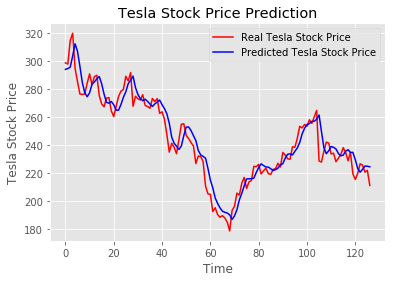

# Walking through Support Vector Regression and LSTMs with stock price prediction
Check out the medium article I wrote on this project [here](https://towardsdatascience.com/walking-through-support-vector-regression-and-lstms-with-stock-price-prediction-45e11b620650?source=friends_link&sk=f6c15227acfc7cf58501522d098ea8f4)

## Purpose:
In this project I wanted to learn the basics of time series analysis using Support Vector Regression and LSTM Recurrent neural networks.  

## Example output:



## Built with:
* python=3.6.4
* numpy=1.16.4
* Tensorflow=1.14.0
* Keras=2.2.4

## Files: 
* Raw_Stock_Prediction.ipynb - Source code for the model 
* LSTM_Stock_Prediction_Explanation.ipynb - The full model source code along with explanations of the code and explanations of concepts like Support Vector Regression, LSTMs, and Linear Regression
* Images - contains the visual aid image files used in the explanation notebook

## Usage 
To start the notebook run ```jupyter notebook``` in terminal 
